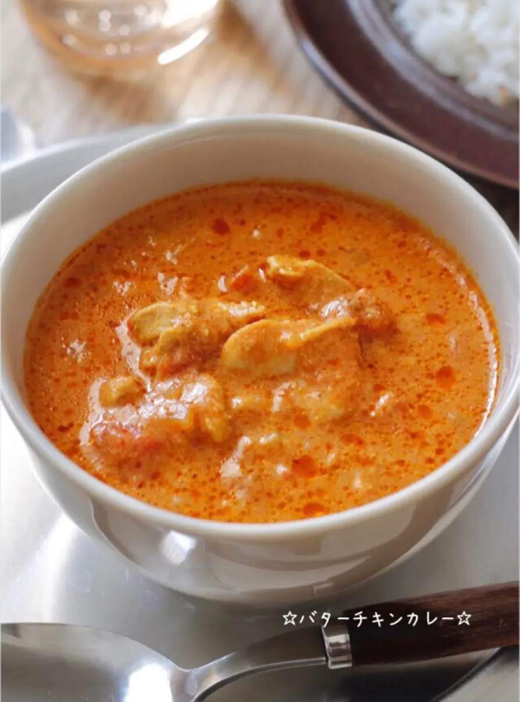
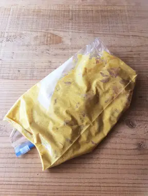
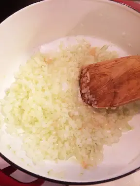
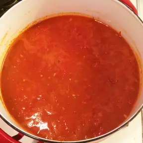
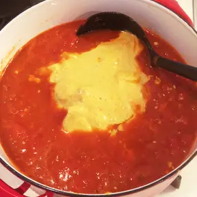

# ☆おいしいバターチキンカレーの作り方☆

★★★殿堂入りレシピ★★★つくれぽ2500件
とろっとクリーミーで辛過ぎない
しかも鶏肉ホロホロ♪一晩おくのがおすすめ♪

#材料　(4～5人前)
◎鶏もも肉（または胸肉）　２枚
***
◎プレーンヨーグルト ２００g
***
◎カレー粉 大さじ２
***
玉ねぎのみじん切り １個
***
にんにくのみじん切り １かけ
***
しょうがすりおろし（チューブでも） 小さじ1
***
サラダ油(炒め用) 大さじ１
***
●水 ２００ml
●カットトマト缶 １缶
●コンソメ １個
●砂糖 大さじ1と1/2
●砂糖 大さじ1と1/2
●しょうゆ 大さじ１
●みりん 大さじ１
●塩 小さじ１
●ソース 小さじ１
●カレー粉 小さじ１
●生クリーム 大さじ３
●バター ４０g

|1|2 |
| -- | -- |
|  | |
| 鶏肉は食べやすい大きさに切る♪ポリ袋に◎の鶏肉とヨーグルトとカレー粉を入れよく揉み冷蔵庫で３時間以上おく♪ | 鍋にサラダ油とにんにくみじん切り、しょうがを入れ弱火で香りを立たせたら、みじん切りにした玉ねぎも加えて弱火で３分炒める♪ |
|  | |
|●の調味料を加えてよく混ぜ中火で５分煮込む♪
（煮込んでからブレンダーでなめらかにしても♪）|①の鶏肉をヨーグルトごと加えてよく混ぜ、弱火で約２０分煮込む♪|
|  | |
|生クリームとバターを加えてよく混ぜ、一煮立ちしたら♪|出来上がり＊|

今回使用させて頂いた画像は [cokpad](https://cookpad.com/recipe/4021261) で掲載されている画像を使用させていただきました。