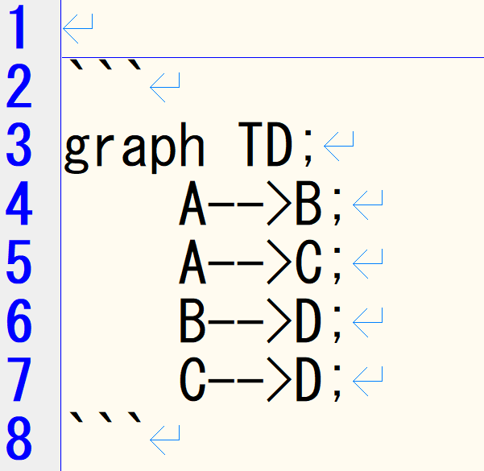
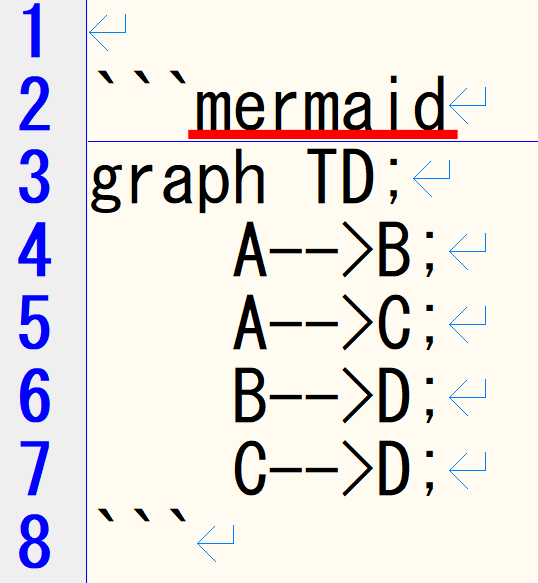
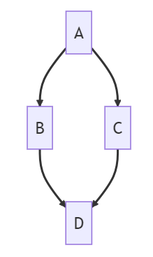
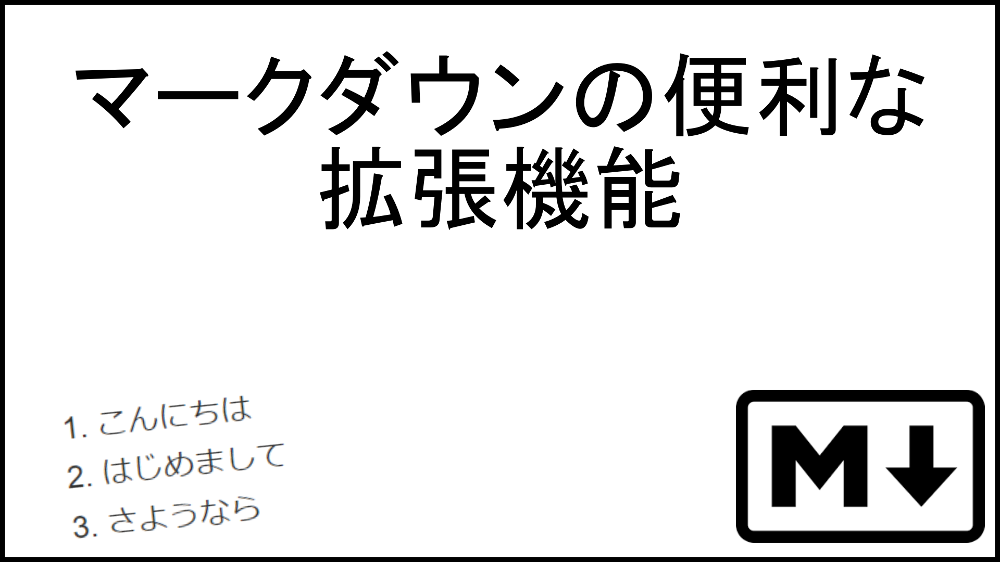

# マーメイド記法の使い方
VSCodeでMermaid記法を使って様々なフローチャートやシステム開発で使われるシーケンス図、ガントチャートなどを表示できます。

今回はそのMermaidを利用する方法や便利な拡張機能について説明していきます。
***
### Mermaid記法を表示する方法
まずはMermaid記法を表示する方法を解説していきたいと思います。

今回は例としてダイアグラムを使用していきます。
まず初めに



こちらがダイアグラムのコードです。こちらを表示するには。

|mermaidを表示させる方法| 実際に表示されるダイアグラム |
| -- | -- |
|||
なんと```の横にmermaidと書くだけなんです！！
めちゃくちゃ簡単☆
これでマーメイドを表示する方法はマスターできましたね。

### 拡張機能について
Vscodeには様々な拡張機能があります。今回はMarkdownを書く際に便利な拡張機能を紹介します。
***
# Markdown ALL in One
***

Markdownを書く際に非常に便利な拡張機能です。

下の画像をクリックすると実際どのように動作するのか
YouTubeに投稿してますのでご覧ください

[](https://www.youtube.com/watch?v=xBREUPEOTBI)

