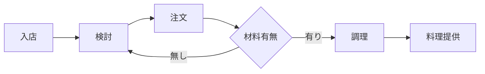
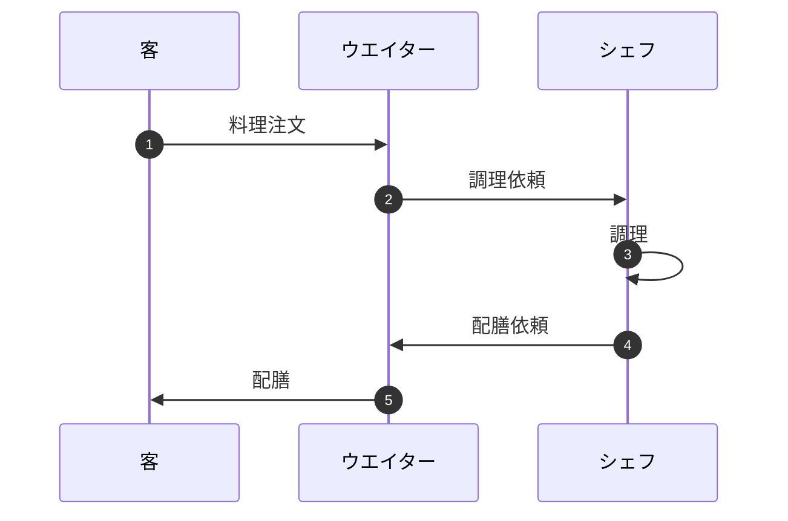
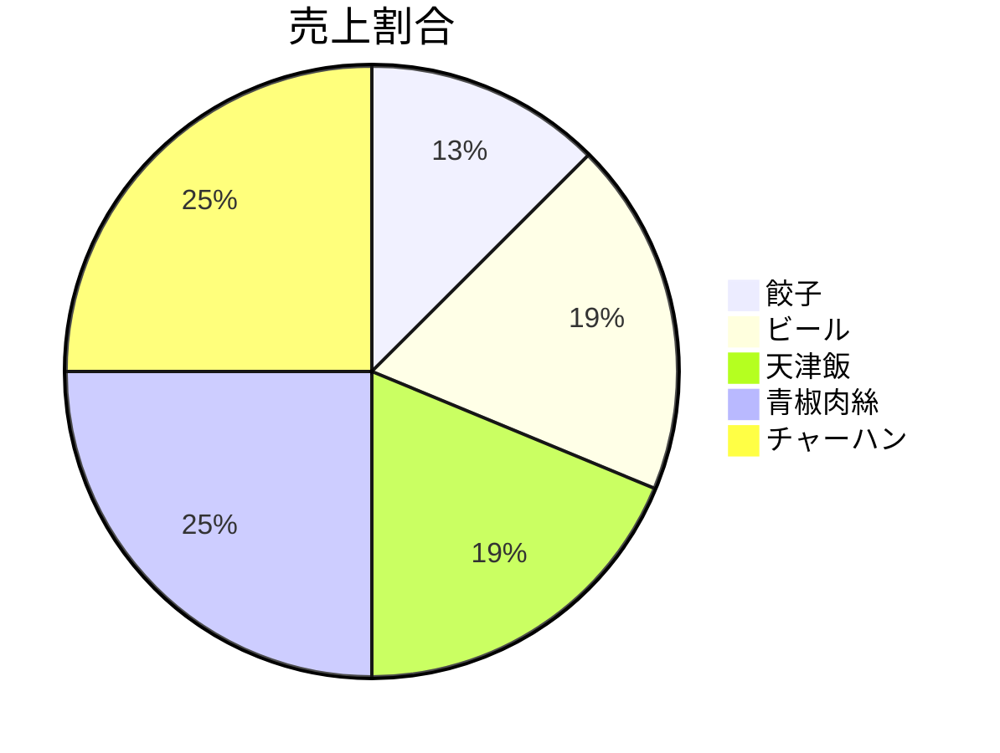

# マークダウンで使えるダイアグラム
***
## はじめに
マークダウンでは様々なダイアグラムを作ることができます。
まずはいくつか紹介していきます。
***
## フローチャート図
    ```
        graph LR;
            enter[入店];
            consider[検討];
            order[注文];
            confirm{材料有無};
            cook[調理];
            serve[料理提供];
            enter --> consider;
            consider --> order;
            order --> confirm;
            confirm -- 無し --> consider;
            confirm -- 有り --> cook;
            cook --> serve;
　　```


***
## シーケンス図の例
```
    sequenceDiagram
        autonumber
        participant guest as 客
        participant waiter as ウエイター
        participant sheff as シェフ
        guest ->> waiter: 料理注文
        waiter ->> sheff: 調理依頼
        sheff ->> sheff: 調理
        sheff ->> waiter: 配膳依頼
        waiter ->> guest: 配膳
```


***
円グラフ

```
pie title 売上割合
        "餃子" : 10
        "ビール" : 15
        "天津飯" : 15
        "青椒肉絲" : 20
        "餃子" : 20
        "チャーハン" : 20
```


***
このようにマークダウンでは様々なダイアグラムを作成することが可能です。

参考:https://www.engineer-route.com/column/8973/