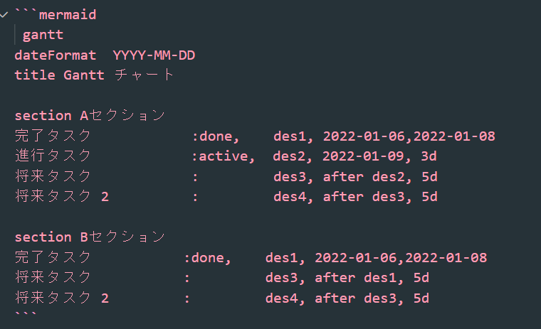
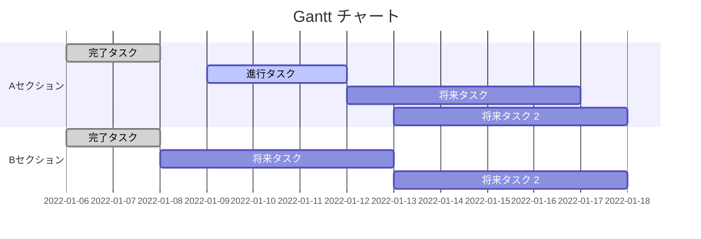
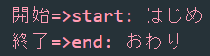
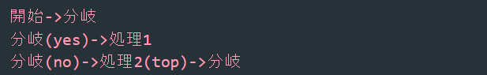

# フローチャート図の作成方法

今回はマークダウンでガントチャート図を作成する
チュートリアルを説明していこうと思います。
***
## ガントチャート
***

```mermaid
gantt
dateFormat  YYYY-MM-DD
title Gantt チャート

section Aセクション
完了タスク            :done,    des1, 2022-01-06,2022-01-08
進行タスク        　  :active,  des2, 2022-01-09, 3d
将来タスク            :         des3, after des2, 5d
将来タスク 2          :         des4, after des3, 5d

section Bセクション
完了タスク           :done,    des1, 2022-01-06,2022-01-08
将来タスク           :         des3, after des1, 5d
将来タスク 2         :         des4, after des3, 5d
```

## 作り方
***

まずは一行目に『gantt』と記入することでガントチャートを作ることができます。

参考したサイト:https://ai-research-collection.com/gantt-mermaid/