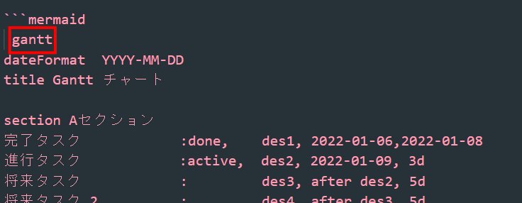

# フローチャート図の作成方法

今回はマークダウンでフローチャート図を作成する
チュートリアルを説明していこうと思います。
***
## フローチャート
***

```
開始=>start: はじめ
終了=>end: おわり

分岐(align-next=no)=>condition: 遊びにいってもいい？
処理1=>operation: 家に行く
定義済み処理=>subroutine: ゲームをする

分岐2=>condition: そろそろ帰った方がいい？
処理2=>operation: それは残念

開始->分岐
分岐(yes)->処理1
分岐(no)->処理2(top)->分岐

処理1->定義済み処理(right)->分岐2
分岐2(yes)->終了
分岐2(no, bottom)->処理1
```
## 作り方
***


まずは[名前]=>[種別]:でパーツを宣言します。

その後[名前]->[名前]でつなぎます

このようにしてフローチャート図を作成していきます。

参考したサイト:https://qiita.com/yoktave-yoknel/items/b923fe2b9206beab700c