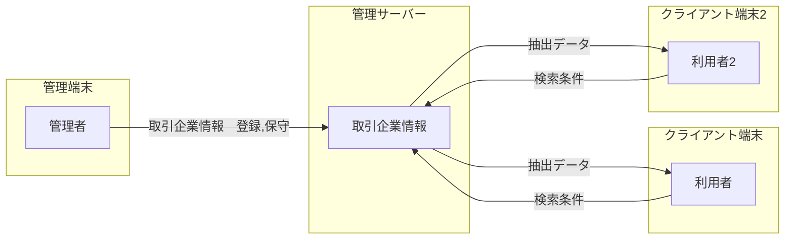

# システム全体図

```mermaid
graph LR
    subgraph 管理サーバー
        取引企業情報
    end

        subgraph クライアント端末
        利用者
    end

            subgraph クライアント端末2
        利用者2
    end

                subgraph 管理端末
        管理者
    end

    利用者 -->|検索条件| 取引企業情報
    取引企業情報---->|抽出データ|利用者;
    利用者2 --> |検索条件|取引企業情報
    取引企業情報---->|抽出データ|利用者2;
    管理者 --> |取引企業情報　登録,保守|取引企業情報
```
### 利用者操作
・ 初めて利用する場合は、ユーザー登録を行う
・ ブラウザを利用して、条件を入力して情報を取得する

### 管理者操作
・ ブラウザよちログインして利用する
・ ブラウザより企業情報を登録・保守を行いデータベースを管理する