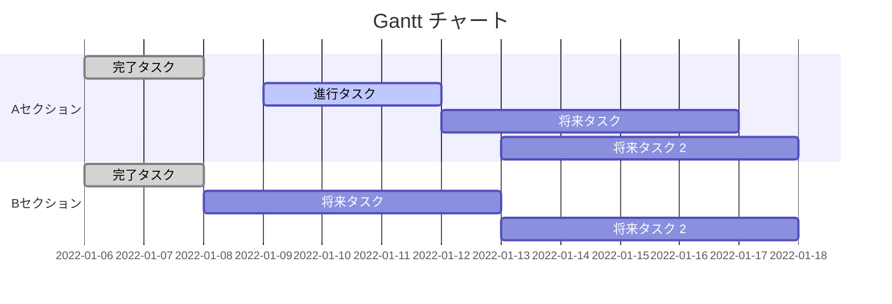

 | No             | タスク名      | 開始日  | 開始日         |内容|
 | -------------- | ------------- | ------- | ------- | ------- | ------- | ------- | ------- |
 | 1 | 企画書作成 | 56 | 514 | ○○○○○○○ | 
 | 2 | 要件定義 | 517 | 521 | ○○○○○○○ |
 | 3 | 設計 | 524 | 64 | ○○○○○○○ |
 | 4 | 開発準備 | 621 | 625 | ○○○○○○○ |
 | 5 | 開発 | 628 | 813 | ○○○○○○○ |
 | 6 | デバック | 810 | 820 | ○○○○○○○ |
 | 7 | プレゼン資料作成 | 823 | 827 | ○○○○○○○ |
 | 8 | プレゼンテーション | 830 | 830 | ○○○○○○○ |

